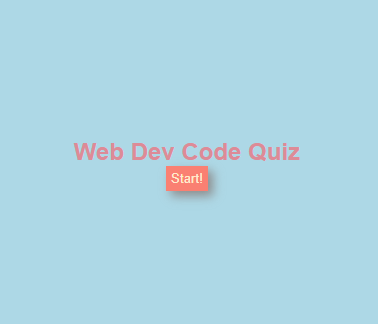

# Timed Web Development Code Quiz

## Description
This is a timed quiz web app about web development code. This application was created to learn more about setIntervals, timeIntervals. As well as getting more acquainted with Javascript selectors and functions. If you wanted to quiz yourself and see how well you do on this code quiz, as well as compare your quiz score with other players, you can take this short quiz. I've learned and am still learning on just how javascript seems to go about reading things. Calling if else statements, and for loops and such.

## Installation
N/A

## Usage Images

## Usage
Visit Page: https://kanabaki.github.io/timed-code-quiz/

When the start button is clicked, a timer triggers and I'm presented with a question,and a timer starts. when I answer a question, I progress to the next question. If an answer is wrong, time is docked. When all questions are answered or the timer reaches 0 then the quiz game is over. Then I can save my initials and score, so that way, I can gauge my progress compared to my peers.

## Credits

## License
MIT License

Copyright (c) [2023] [Eduardo Perez]

Permission is hereby granted, free of charge, to any person obtaining a copy
of this software and associated documentation files (the "Software"), to deal
in the Software without restriction, including without limitation the rights
to use, copy, modify, merge, publish, distribute, sublicense, and/or sell
copies of the Software, and to permit persons to whom the Software is
furnished to do so, subject to the following conditions:

The above copyright notice and this permission notice shall be included in all
copies or substantial portions of the Software.

THE SOFTWARE IS PROVIDED "AS IS", WITHOUT WARRANTY OF ANY KIND, EXPRESS OR
IMPLIED, INCLUDING BUT NOT LIMITED TO THE WARRANTIES OF MERCHANTABILITY,
FITNESS FOR A PARTICULAR PURPOSE AND NONINFRINGEMENT. IN NO EVENT SHALL THE
AUTHORS OR COPYRIGHT HOLDERS BE LIABLE FOR ANY CLAIM, DAMAGES OR OTHER
LIABILITY, WHETHER IN AN ACTION OF CONTRACT, TORT OR OTHERWISE, ARISING FROM,
OUT OF OR IN CONNECTION WITH THE SOFTWARE OR THE USE OR OTHER DEALINGS IN THE
SOFTWARE.

---